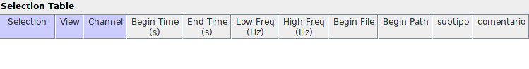

<b>Protocol de anotación de VUS</b> 
================
<a href="marce10.github.io">Marcelo
Araya-Salas, PhD</a> 

*Updated on 2023-03-29 16:00:35*

<!-- README.md is generated from README.Rmd. Please edit that file -->

## Propósito

- *Este protocolo explica los pasos necesarios para llevar a cabo annotaciones de las llamadas ultrasonicas de ratas Winstar*.

 

------------------------------------------------------------------------

## Enlaces

- [Hoja de datos con lista de archivos de audio](https://docs.google.com/spreadsheets/d/1oNB9kOEIUy8QLAHQobm9EE4f47GmrbwAtTHT8yO9L2M/edit?usp=sharing)
- [Grabaciones]()
- [window preset de Raven](https://drive.google.com/drive/folders/1SP_0krVDkJQiOzQQaipVTd1lrvNle-FE?usp=sharing)
- [Carpeta para subir anotaciones](https://drive.google.com/drive/folders/1WJcLtCaJ7d9cnKnnmhEp8RXj1H86YOJ0?usp=sharing)
- [Reporte del estado de las anotaciones]()
- [Espectrogramas anotados]()

------------------------------------------------------------------------

## Flujo de trabajo de análisis

1.  Escoja uno de los archivos en la [hoja de anotaciones](https://docs.google.com/spreadsheets/d/1oNB9kOEIUy8QLAHQobm9EE4f47GmrbwAtTHT8yO9L2M/edit?usp=sharing) y escriba su nombre en la columna "asignado_a" (si no le permite editar haganos saber):

  

&nbsp;

2. Abra el archivo en Raven Pro: Ctrl + O (or ir a "File" → "Open Sound Files..."). 

  

&nbsp;

3.  Cuando abra el archivo, aparecerá la ventana "Configure New Sound Window".aparecerá. En la ventana "Window Preset", elija la opción "VUS-2023-WINDOWS" o "VUS-2023-MAC" (dependiendo de su sistema operativo)
    y, a continuación, haga clic en "Aceptar" (si esta ventana no se abre al cargar un archivo, debe ir a View → Window Preset and select "VUS-2023 ..."). Para tener esta opción disponible primero debe descargar el archivo de preajuste desde
    [aquí para windows](https://github.com/maRce10/bird_song_evolution/raw/master/bird_songs) y [aquí para Mac](https://github.com/maRce10/acoustic_analysis_USV_CIN/raw/master/scripts/VUS-2023-MAC)
    y debe copiarlo en
 “./RavenPro1.6/Presets/Sound Window” (pueden usar su buscador para encontrar la carpeta de RavenPro en su computadora):

&nbsp;

4. Si el archivo es muy pesado y su computadora tiene problemas abriéndolo pueden usar la opción "paging" para abrir los archivos gradualmente:

&nbsp;

5. Puede modificar el contraste y brillo si le es difícil distinguir los sonidos:

&nbsp;

6. Asegúrese de que la resolución de los ejes de tiempo y frecuencia le permiten ver con claridad las señales. Idealmente el rango de frecuencia debe estar entre 18 y 100 kHz y mientras la resolución del tiempo debe ser cercana a 0.5 segundos:

&nbsp;

7. El cuadro de selección debe contener las siguientes columnas:

&nbsp;

8. Debe clasificar cada sonido anotado en uno de los siguientes subtipos:

El número del subtipo debe anotarse en la columna "subtipo". Cualquier duda sobre la anotación se puede escribir en la columna "comentario".

&nbsp;

9. Cuando haya terminado de anotar el archivo suba el archivo .txt a la [carpeta de anotaciones](https://drive.google.com/drive/folders/1WJcLtCaJ7d9cnKnnmhEp8RXj1H86YOJ0?usp=sharing) (si no le permite editar haganos saber) y escriba la fecha en [hoja de anotaciones](https://docs.google.com/spreadsheets/d/1oNB9kOEIUy8QLAHQobm9EE4f47GmrbwAtTHT8yO9L2M/edit?usp=sharing):

  

&nbsp;

------------------------------------------------------------------------

## Status

Este proyecto se encuentra: *en progreso*

## Contacto

Creado por [Marcelo Araya-Salas](marce10.github.io/)
